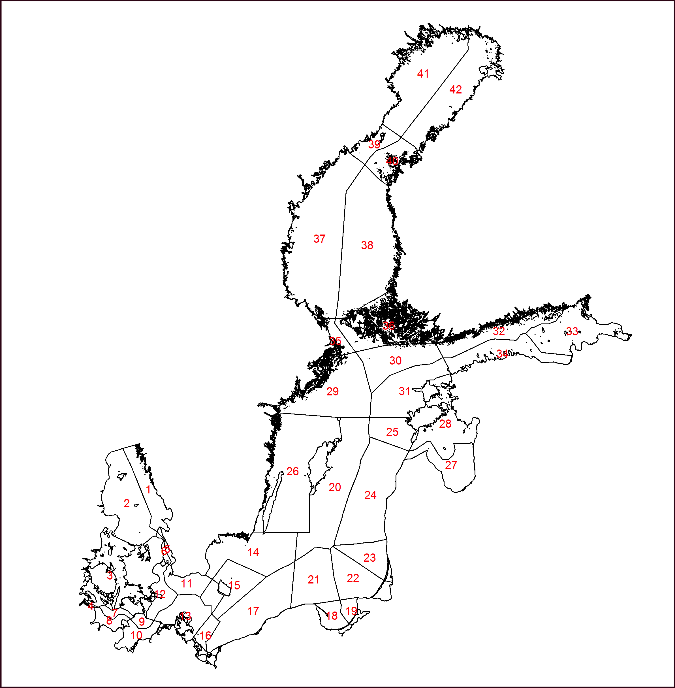

---

#  Ocean Health Index for the Baltic 

### `BHI 2.0`

As of January of 2019, we began working on our second Baltic Health Index assessment! We will be building on the earlier goal models, making improvements where possible, and including new datasets where relevant. We hope also to be able to conduct scenario testing and sensitivity analysis, create features for interactive data exploration/presentation, and assess interconnectivity of goals.

**Explore the BHI on GitHub:**  
[Functions for calculating Status and Trend](https://github.com/OHI-Science/bhi/blob/master/baltic/conf/functions.R)  
[Video about following BHI progress in GitHub](https://www.youtube.com/watch?v=u5BRx05Wmwo)  
[Data preparation](https://github.com/OHI-Science/bhi-prep/tree/master/prep) 

---

## BHI regions
Our region of focus is the [Baltic Sea](https://www.google.se/maps/place/Baltic+Sea/@59.9996367,11.5210982,1517181m/data=!3m1!1e3!4m5!3m4!1s0x46f4d7d988201b2b:0xb43097ae8474cb3!8m2!3d58.487952!4d19.863281). The BHI regions are based upon Baltic Sea basins used in the HELCOM HOLAS assessement and the exclusive economic zones of the nations surrounding the Baltic Sea. Each of the 42 BHI regions belongs to a single bio-physcial basin and is associated with a single nation. The map below shows the 42 regions used in the assessment.

 

  

 

---

### Learn more about the Baltic Health Index  
[BHI at the Stockholm Resilience Centre](http://www.stockholmresilience.org/research/research-themes/marine/baltic-health-index.html)  
[BHI at the Baltic Sea Center in English](http://www.su.se/ostersjocentrum/english/baltic-eye/research/baltic-health-index)  
[BHI at the Baltic Sea Center in Swedish](http://www.su.se/ostersjocentrum/baltic-eye/forskning/baltic-health-index)  
[Ocean Health Index](http://www.oceanhealthindex.org/about)  
[Ocean Health Index Science](http://ohi-science.org)

---

### The Ocean Health Index framework

Oceans in general provide a diverse array of benefits to humans. Managing for such a broad range of benefits requires a method of measurement that is both comprehensive and quantitative. Establishing such a method was the motivation behind the [development of the Ocean Health Index](https://www.nature.com/articles/nature11397). 

Trade-offs and linkages between the different benefits, a sparsity of data about the detailed goings-on in the oceans' depths, and conflicting views on what constitutes responsible resource use makes sustainable management a big task, especially when optimal management requires assessments to be made regularly so trends can be identified and effectiveness of management strategies can be analyzed. Borrowing tools and workflows  application development and business analytics, we aim to make our work not only reproducible and transparent, but more time-efficient with each iteration (read more about this: [Better Science in Less Time](https://www.nature.com/articles/s41559-017-0160)).

---
