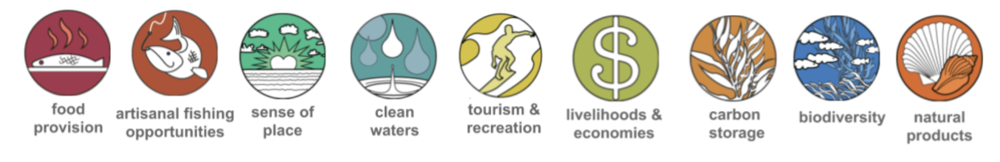

---
output:
  html_document:
    toc: true
    toc_float: true
    toc_depth: 2
---

<style>
  .col2 {
    columns: 2 200px;
    -webkit-columns: 2 200px; /* chrome, safari */
    -moz-columns: 2 200px;   /* firefox */
  }
</style>

<br>

<div style="background-color:#ffffff;border-width:4px;border-color:#ffffff;">


<br>

<p style="margin: 3px 3px;">
The Ocean Health Index measures the ability of oceans to sustainably provide products or services (called “goals”) that are important to humans. The Baltic's Ocean Health Index assessments score 9 goals, some of which have sub-goals. Here you will find a description of the goals used in global assessments.
</p>

<div style="width: 97%;">


<p style="margin: 3px 3px;">

Goal-by-goal, you can explore the data used to model status and trend, as well as the pressures and resilience measures contributing to goal scores.

Goal scores are calculated by modeling data first as Present Status and Likely Future State. Likely Future State is a combination of status, trend, pressures and resilience calculations, which unequally contribute to goal scores.

Scroll down for a description of each goal as well as the model and data used to calculate the goal (blue text links to descriptions of the specific data used in the calculation of each goal).

</p>
</div>

<div style="clear:both;"></div>
</div>


```{r setup, echo = FALSE, message = FALSE, warning = FALSE}
source(here::here("_site.R"))
short_goal_web <- file.path(bhiprep_gh_raw, "master", "supplement", "goal_summaries")

st0 <- layers %>%
  select(targets, name, layer, description) %>% 
  filter(name != "proxy_layer") %>% 
  mutate(description = ifelse(
    is.na(description), 
    "See goal description above or data prep documents for more information.", 
    description
  )) %>% 
  mutate(description = str_remove_all(description, pattern = "\\n\\n\\n")) %>% 
  mutate(
    name_abbrev = name %>% 
      str_replace_all(pattern = "\\(", replacement = "openparentheses ") %>% 
      str_replace_all(pattern = "\\.", replacement = " periodpunctuation") %>% 
      str_replace_all(pattern = "to be used", replacement = "tobeused") %>% 
      str_replace_all(pattern = "based on|based upon", replacement = "basedon") %>% 
      str_replace_all(pattern = "of the European Parliament", replacement = "oftheEuropeanParliament")
  ) %>%
  rowwise() %>% 
  mutate(
    name_abbrev = ifelse(
      str_length(name) < 35,
      name,
      str_split(
        name_abbrev,
        pattern = paste0("\\s", 
          intersect(
             c(
               "oftheEuropeanParliament", "openparentheses", 
               "periodpunctuation", ",", "basedon", "tobeused", "as", "of"),
            str_split(name_abbrev, pattern = " ") %>% unlist())[1], "\\s"
        )
      )[[1]][1]
    )
  ) %>%
  mutate(
    name_abbrev = name_abbrev %>% 
      str_replace_all(pattern = " periodpunctuation", replacement = "\\.") %>% 
      str_replace_all(pattern = " basedon", replacement = " based on")) %>%
  mutate(
    web_name = str_to_lower(gsub(" ", "_", name_abbrev)) %>% 
      gsub(pattern = "/", replacement = "")
  ) %>% 
  mutate(info = sprintf(
    "[%s](%s#%s) (%s)", 
    name_abbrev, 
    "http://ohi-baltic.github.io/bhi/layers.html", 
    web_name, layer
  ))

prs_matrix <- readr::read_csv(file.path(bhi_gh_raw, "master", "index", "conf", "pressures_matrix.csv"))
res_matrix <- readr::read_csv(file.path(bhi_gh_raw, "master", "index", "conf", "resilience_matrix.csv"))
```


---

## Food Provision: Fisheries 

<br>

```{r, echo = FALSE, results = "hide"}
tmp <- tempfile(fileext = "Rmd")
on.exit(unlink(tmp))
download.file(file.path(short_goal_web, "FIS.Rmd"), tmp) 

read_file(tmp) %>% 
  str_replace_all("#{2,4} [0-9.]+", "<br>") %>% 
  write_file(tmp)
```
 
```{r, child = tmp, echo = FALSE, results = "asis"} 
``` 

[**Full data preparation information and code**](https://github.com/OHI-Baltic/bhi-prep/blob/master/prep/FIS/v2019/fis_np_prep.md)  

<br>

### Download Data Layers

```{r, echo = FALSE, warning = FALSE, error = FALSE, results = "asis"}
st <- filter(st0, targets %in% "FIS")
cat(paste(st$info, collapse = "\n\n"))
``` 

```{r, echo = FALSE, warning = FALSE, error = FALSE, results = "asis"}
prs_lyr <- prs_matrix %>%
  filter(goal == "FIS") %>% 
  select_if(function(x) {!all(is.na(x))}) %>% 
  select(-goal) %>% names()

st <- filter(st0, targets %in% "pressures", layer %in% prs_lyr)
cat(paste(st$info, collapse = "\n\n"))
``` 

```{r, echo = FALSE, warning = FALSE, error = FALSE, results = "asis"}
res_lyr <- res_matrix %>%
  filter(goal == "FIS") %>% 
  select_if(function(x) {!all(is.na(x))}) %>% 
  select(-goal) %>% names()

st <- filter(st0, targets %in% "resilience", layer %in% res_lyr)
cat(paste(st$info, collapse = "\n\n"))
``` 

<br>

--- 

## Food Provision: Mariculture
<br>

```{r, echo = FALSE, results = "hide"}
tmp <- tempfile(fileext = "Rmd")
on.exit(unlink(tmp))
download.file(file.path(short_goal_web, "MAR.Rmd"), tmp) 

read_file(tmp) %>% 
  str_replace_all("#{2,4} [0-9.]+", "<br>") %>% 
  write_file(tmp)
```
 
```{r, child = tmp, echo = FALSE, results = "asis"} 
``` 

[**Full data preparation information and code**](https://github.com/OHI-Baltic/bhi-prep/blob/master/prep/MAR/v2019/mar_prep.md)  

<br> 

### Download Data Layers

```{r, echo = FALSE, warning = FALSE, error = FALSE, results = "asis"}
st <- filter(st0, targets %in% "MAR")
cat(paste(st$info, collapse = "\n\n"))
``` 

```{r, echo = FALSE, warning = FALSE, error = FALSE, results = "asis"}
prs_lyr <- prs_matrix %>% 
  filter(goal == "MAR") %>%
  select_if(function(x) {!all(is.na(x))}) %>%    
  select(-goal) %>% names()  

st <- filter(st0, targets %in% "pressures", layer %in% prs_lyr)
cat(paste(st$info, collapse = "\n\n"))
``` 

```{r, echo = FALSE, warning = FALSE, error = FALSE, results = "asis"}
res_lyr <- res_matrix %>%   
  filter(goal == "MAR") %>%    
  select_if(function(x) {!all(is.na(x))}) %>%    
  select(-goal) %>% names()  

st <- filter(st0, targets %in% "resilience", layer %in% res_lyr)
cat(paste(st$info, collapse = "\n\n"))
``` 

<br>

--- 

## Artisanal Fishing Opportunity
<br>

```{r, echo = FALSE, results = "hide"}
tmp <- tempfile(fileext = "Rmd")
on.exit(unlink(tmp))
download.file(file.path(short_goal_web, "AO.Rmd"), tmp) 

read_file(tmp) %>% 
  str_replace_all("#{2,4} [0-9.]+", "<br>") %>% 
  write_file(tmp)
```
 
```{r, child = tmp, echo = FALSE, results = "asis"} 
``` 


[**Full data preparation information and code**](https://github.com/OHI-Baltic/bhi-prep/blob/master/prep/AO/v2019/ao_prep.md)  

<br> 

### Download Data Layers

```{r, echo = FALSE, warning = FALSE, error = FALSE, results = "asis"}
st <- filter(st0, targets %in% "AO")
cat(paste(st$info, collapse = "\n\n"))
``` 

```{r, echo = FALSE, warning = FALSE, error = FALSE, results = "asis"}
prs_lyr <- prs_matrix %>%   
  filter(goal == "AO") %>%    
  select_if(function(x) {!all(is.na(x))}) %>%    
  select(-goal) %>% names()  

st <- filter(st0, targets %in% "pressures", layer %in% prs_lyr)
cat(paste(st$info, collapse = "\n\n"))
``` 

```{r, echo = FALSE, warning = FALSE, error = FALSE, results = "asis"}
res_lyr <- res_matrix %>%   
  filter(goal == "AO") %>%    
  select_if(function(x) {!all(is.na(x))}) %>%    
  select(-goal) %>% names()  

st <- filter(st0, targets %in% "resilience", layer %in% res_lyr)
cat(paste(st$info, collapse = "\n\n"))
``` 

<br>

--- 

## Natural Products
<br>

```{r, echo = FALSE, results = "hide"}
tmp <- tempfile(fileext = "Rmd")
on.exit(unlink(tmp))
download.file(file.path(short_goal_web, "NP.Rmd"), tmp) 

read_file(tmp) %>% 
  str_replace_all("#{2,4} [0-9.]+", "<br>") %>% 
  write_file(tmp)
```
 
```{r, child = tmp, echo = FALSE, results = "asis"} 
``` 


[**Full data preparation information and code**](https://github.com/OHI-Baltic/bhi-prep/blob/master/prep/NP/v2019/np_prep.md)  

<br> 

### Download Data Layers

```{r, echo = FALSE, warning = FALSE, error = FALSE, results = "asis"}
st <- filter(st0, targets %in% "NP")
cat(paste(st$info, collapse = "\n\n"))
``` 

```{r, echo = FALSE, warning = FALSE, error = FALSE, results = "asis"}
prs_lyr <- prs_matrix %>%   
  filter(goal == "NP") %>%    
  select_if(function(x) {!all(is.na(x))}) %>%    
  select(-goal) %>% names()  

st <- filter(st0, targets %in% "pressures", layer %in% prs_lyr)
cat(paste(st$info, collapse = "\n\n"))
``` 

```{r, echo = FALSE, warning = FALSE, error = FALSE, results = "asis"}
res_lyr <- res_matrix %>%   
  filter(goal == "NP") %>%    
  select_if(function(x) {!all(is.na(x))}) %>%    
  select(-goal) %>% names()  

st <- filter(st0, targets %in% "resilience", layer %in% res_lyr)
cat(paste(st$info, collapse = "\n\n"))
``` 

<br>

--- 

## Carbon Storage
<br>

```{r, echo = FALSE, results = "hide"}
tmp <- tempfile(fileext = "Rmd")
on.exit(unlink(tmp))
download.file(file.path(short_goal_web, "CS.Rmd"), tmp) 

read_file(tmp) %>% 
  str_replace_all("#{2,4} [0-9.]+", "<br>") %>% 
  write_file(tmp)
```
 
```{r, child = tmp, echo = FALSE, results = "asis"} 
``` 

[**Full data preparation information and code**](https://github.com/OHI-Baltic/bhi-prep/blob/master/prep/CS/v2019/cs_prep.md)  

<br> 

### Download Data Layers

```{r, echo = FALSE, warning = FALSE, error = FALSE, results = "asis"}
st <- filter(st0, targets %in% "CS")
cat(paste(st$info, collapse = "\n\n"))
``` 

```{r, echo = FALSE, warning = FALSE, error = FALSE, results = "asis"}
prs_lyr <- prs_matrix %>%   
  filter(goal == "CS") %>%    
  select_if(function(x) {!all(is.na(x))}) %>%    
  select(-goal) %>% names()  

st <- filter(st0, targets %in% "pressures", layer %in% prs_lyr)
cat(paste(st$info, collapse = "\n\n"))
``` 

```{r, echo = FALSE, warning = FALSE, error = FALSE, results = "asis"}
res_lyr <- res_matrix %>%   
  filter(goal == "CS") %>%    
  select_if(function(x) {!all(is.na(x))}) %>%    
  select(-goal) %>% names() 

st <- filter(st0, targets %in% "resilience", layer %in% res_lyr)
cat(paste(st$info, collapse = "\n\n"))
``` 

<br>

--- 

## Tourism & Recreation
<br>

```{r, echo = FALSE, results = "hide"}
tmp <- tempfile(fileext = "Rmd")
on.exit(unlink(tmp))
download.file(file.path(short_goal_web, "TR.Rmd"), tmp) 

read_file(tmp) %>% 
  str_replace_all("#{2,4} [0-9.]+", "<br>") %>% 
  write_file(tmp)
```
 
```{r, child = tmp, echo = FALSE, results = "asis"} 
``` 

[**Full data preparation information and code**](https://github.com/OHI-Baltic/bhi-prep/blob/master/prep/TR/v2019/tr_prep.md)  

<br> 

### Download Data Layers

```{r, echo = FALSE, warning = FALSE, error = FALSE, results = "asis"}
st <- filter(st0, targets %in% "TR")
cat(paste(st$info, collapse = "\n\n"))
``` 

```{r, echo = FALSE, warning = FALSE, error = FALSE, results = "asis"}
prs_lyr <- prs_matrix %>%   
  filter(goal == "TR") %>%    
  select_if(function(x) {!all(is.na(x))}) %>%    
  select(-goal) %>% names()  

st <- filter(st0, targets %in% "pressures", layer %in% prs_lyr)
cat(paste(st$info, collapse = "\n\n"))
``` 

```{r, echo = FALSE, warning = FALSE, error = FALSE, results = "asis"}
res_lyr <- res_matrix %>%   
  filter(goal == "TR") %>%    
  select_if(function(x) {!all(is.na(x))}) %>%    
  select(-goal) %>% names()  

st <- filter(st0, targets %in% "resilience", layer %in% res_lyr)
cat(paste(st$info, collapse = "\n\n"))
``` 

<br>

--- 

## Livelihoods & Economies: Livelihoods
<br>

```{r, echo = FALSE, results = "hide"}
tmp <- tempfile(fileext = "Rmd")
on.exit(unlink(tmp))
download.file(file.path(short_goal_web, "LIV.Rmd"), tmp) 

read_file(tmp) %>% 
  str_replace_all("#{2,4} [0-9.]+", "<br>") %>% 
  write_file(tmp)
```
 
```{r, child = tmp, echo = FALSE, results = "asis"} 
``` 

[**Full data preparation information and code**](https://github.com/OHI-Baltic/bhi-prep/blob/master/prep/LIV/v2019/liv_prep.md)  

<br> 

### Download Data Layers

```{r, echo = FALSE, warning = FALSE, error = FALSE, results = "asis"}
st <- filter(st0, targets %in% "LIV")
cat(paste(st$info, collapse = "\n\n"))
``` 

```{r, echo = FALSE, warning = FALSE, error = FALSE, results = "asis"}
prs_lyr <- prs_matrix %>%   
  filter(goal == "LIV") %>%    
  select_if(function(x) {!all(is.na(x))}) %>%    
  select(-goal) %>% names()  

st <- filter(st0, targets %in% "pressures", layer %in% prs_lyr)
cat(paste(st$info, collapse = "\n\n"))
``` 

```{r, echo = FALSE, warning = FALSE, error = FALSE, results = "asis"}
res_lyr <- res_matrix %>%   
  filter(goal == "LIV") %>%    
  select_if(function(x) {!all(is.na(x))}) %>%    
  select(-goal) %>% names()  

st <- filter(st0, targets %in% "resilience", layer %in% res_lyr)
cat(paste(st$info, collapse = "\n\n"))
``` 

<br>

--- 

## Livelihoods & Economies: Economies
<br>

```{r, echo = FALSE, results = "hide"}
tmp <- tempfile(fileext = "Rmd")
on.exit(unlink(tmp))
download.file(file.path(short_goal_web, "ECO.Rmd"), tmp) 

read_file(tmp) %>% 
  str_replace_all("#{2,4} [0-9.]+", "<br>") %>% 
  write_file(tmp)
```
 
```{r, child = tmp, echo = FALSE, results = "asis"} 
``` 

[**Full data preparation information and code**](https://github.com/OHI-Baltic/bhi-prep/blob/master/prep/ECO/v2019/eco_prep.md)  

<br> 
### Download Data Layers

```{r, echo = FALSE, warning = FALSE, error = FALSE, results = "asis"}
st <- filter(st0, targets %in% "ECO")
cat(paste(st$info, collapse = "\n\n"))
``` 

```{r, echo = FALSE, warning = FALSE, error = FALSE, results = "asis"}
prs_lyr <- prs_matrix %>%   
  filter(goal == "ECO") %>%    
  select_if(function(x) {!all(is.na(x))}) %>%    
  select(-goal) %>% names()  

st <- filter(st0, targets %in% "pressures", layer %in% prs_lyr)
cat(paste(st$info, collapse = "\n\n"))
``` 

```{r, echo = FALSE, warning = FALSE, error = FALSE, results = "asis"}
res_lyr <- res_matrix %>%   
  filter(goal == "ECO") %>%    
  select_if(function(x) {!all(is.na(x))}) %>%    
  select(-goal) %>% names()  

st <- filter(st0, targets %in% "resilience", layer %in% res_lyr)
cat(paste(st$info, collapse = "\n\n"))
``` 

<br>

--- 

## Sense of Place: Iconic Species
<br>

```{r, echo = FALSE, results = "hide"}
tmp <- tempfile(fileext = "Rmd")
on.exit(unlink(tmp))
download.file(file.path(short_goal_web, "ICO.Rmd"), tmp) 

read_file(tmp) %>% 
  str_replace_all("#{2,4} [0-9.]+", "<br>") %>% 
  write_file(tmp)
```
 
```{r, child = tmp, echo = FALSE, results = "asis"} 
``` 

[**Full data preparation information and code**](https://github.com/OHI-Baltic/bhi-prep/blob/master/prep/ICO/v2019/ico_prep.md)  

<br> 

### Download Data Layers

```{r, echo = FALSE, warning = FALSE, error = FALSE, results = "asis"}
st <- filter(st0, targets %in% "ICO")
cat(paste(st$info, collapse = "\n\n"))
``` 

```{r, echo = FALSE, warning = FALSE, error = FALSE, results = "asis"}
prs_lyr <- prs_matrix %>% 
  filter(goal == "ICO") %>%    
  select_if(function(x) {!all(is.na(x))}) %>%    
  select(-goal) %>% names()  

st <- filter(st0, targets %in% "pressures", layer %in% prs_lyr)
cat(paste(st$info, collapse = "\n\n"))
``` 

```{r, echo = FALSE, warning = FALSE, error = FALSE, results = "asis"}
res_lyr <- res_matrix %>%   
  filter(goal == "ICO") %>%    
  select_if(function(x) {!all(is.na(x))}) %>%    
  select(-goal) %>% names()  

st <- filter(st0, targets %in% "resilience", layer %in% res_lyr)
cat(paste(st$info, collapse = "\n\n"))
``` 

<br>

--- 

## Sense of Place: Lasting Special Places
<br>

```{r, echo = FALSE, results = "hide"}
tmp <- tempfile(fileext = "Rmd")
on.exit(unlink(tmp))
download.file(file.path(short_goal_web, "LSP.Rmd"), tmp) 

read_file(tmp) %>% 
  str_replace_all("#{2,4} [0-9.]+", "<br>") %>% 
  write_file(tmp)
```
 
```{r, child = tmp, echo = FALSE, results = "asis"} 
``` 

[**Full data preparation information and code**](https://github.com/OHI-Baltic/bhi-prep/blob/master/prep/LSP/v2019/lsp_prep.md)  

<br> 

### Download Data Layers

```{r, echo = FALSE, warning = FALSE, error = FALSE, results = "asis"}
st <- filter(st0, targets %in% "LSP")
cat(paste(st$info, collapse = "\n\n"))
``` 

```{r, echo = FALSE, warning = FALSE, error = FALSE, results = "asis"}
prs_lyr <- prs_matrix %>%   
  filter(goal == "LSP") %>%    
  select_if(function(x) {!all(is.na(x))}) %>%    
  select(-goal) %>% names()  

st <- filter(st0, targets %in% "pressures", layer %in% prs_lyr)
cat(paste(st$info, collapse = "\n\n"))
``` 

```{r, echo = FALSE, warning = FALSE, error = FALSE, results = "asis"}
res_lyr <- res_matrix %>%   
  filter(goal == "LSP") %>%    
  select_if(function(x) {!all(is.na(x))}) %>%    
  select(-goal) %>% names()  

st <- filter(st0, targets %in% "resilience", layer %in% res_lyr)
cat(paste(st$info, collapse = "\n\n"))
``` 

<br>

--- 

## Clean Waters: Eutrophication
<br>

```{r, echo = FALSE, results = "hide"}
tmp <- tempfile(fileext = "Rmd")
on.exit(unlink(tmp))
download.file(file.path(short_goal_web, "EUT.Rmd"), tmp) 

read_file(tmp) %>% 
  str_replace_all("#{2,4} [0-9.]+", "<br>") %>% 
  write_file(tmp)
```
 
```{r, child = tmp, echo = FALSE, results = "asis"} 
``` 

[**Full data preparation information and code**](https://github.com/OHI-Baltic/bhi-prep/blob/master/prep/EUT/v2019/eut_prep.md)  

<br> 

### Download Data Layers

```{r, echo = FALSE, warning = FALSE, error = FALSE, results = "asis"}
st <- filter(st0, targets %in% "EUT")
cat(paste(st$info, collapse = "\n\n"))
``` 

```{r, echo = FALSE, warning = FALSE, error = FALSE, results = "asis"}
prs_lyr <- prs_matrix %>%   filter(goal == "EUT") %>%    
  select_if(function(x) {!all(is.na(x))}) %>%    
  select(-goal) %>% names()  

st <- filter(st0, targets %in% "pressures", layer %in% prs_lyr)
cat(paste(st$info, collapse = "\n\n"))
``` 

```{r, echo = FALSE, warning = FALSE, error = FALSE, results = "asis"}
res_lyr <- res_matrix %>%   
  filter(goal == "EUT") %>%    
  select_if(function(x) {!all(is.na(x))}) %>%    
  select(-goal) %>% names()  

st <- filter(st0, targets %in% "resilience", layer %in% res_lyr)
cat(paste(st$info, collapse = "\n\n"))
``` 

<br>

--- 

## Clean Waters: Trash
<br>

```{r, echo = FALSE, results = "hide"}
tmp <- tempfile(fileext = "Rmd")
on.exit(unlink(tmp))
download.file(file.path(short_goal_web, "TRA.Rmd"), tmp) 

read_file(tmp) %>% 
  str_replace_all("#{2,4} [0-9.]+", "<br>") %>% 
  write_file(tmp)
```
 
```{r, child = tmp, echo = FALSE, results = "asis"} 
``` 

[**Full data preparation information and code**](https://github.com/OHI-Baltic/bhi-prep/blob/master/prep/TRA/v2019/tra_prep.md)  

<br> 

### Download Data Layers

```{r, echo = FALSE, warning = FALSE, error = FALSE, results = "asis"}
st <- filter(st0, targets %in% "TRA")
cat(paste(st$info, collapse = "\n\n"))
``` 

```{r, echo = FALSE, warning = FALSE, error = FALSE, results = "asis"}
prs_lyr <- prs_matrix %>%   
  filter(goal == "TRA") %>%    
  select_if(function(x) {!all(is.na(x))}) %>%    
  select(-goal) %>% names()  

st <- filter(st0, targets %in% "pressures", layer %in% prs_lyr)
cat(paste(st$info, collapse = "\n\n"))
``` 

```{r, echo = FALSE, warning = FALSE, error = FALSE, results = "asis"}
res_lyr <- res_matrix %>%   
  filter(goal == "TRA") %>%   
  select_if(function(x) {!all(is.na(x))}) %>%    
  select(-goal) %>% names()  

st <- filter(st0, targets %in% "resilience", layer %in% res_lyr)
cat(paste(st$info, collapse = "\n\n"))
``` 

<br>

--- 

## Clean Waters: Contaminants
<br>

```{r, echo = FALSE, results = "hide"}
tmp <- tempfile(fileext = "Rmd")
on.exit(unlink(tmp))
download.file(file.path(short_goal_web, "CON.Rmd"), tmp) 

read_file(tmp) %>% 
  str_replace_all("#{2,4} [0-9.]+", "<br>") %>% 
  write_file(tmp)
```
 
```{r, child = tmp, echo = FALSE, results = "asis"} 
``` 

[**Full data preparation information and code**](https://github.com/OHI-Baltic/bhi-prep/blob/master/prep/CON/v2019/con_prep.md)  

<br> 

### Download Data Layers

```{r, echo = FALSE, warning = FALSE, error = FALSE, results = "asis"}
st <- filter(st0, targets %in% "CON")
cat(paste(st$info, collapse = "\n\n"))
``` 

```{r, echo = FALSE, warning = FALSE, error = FALSE, results = "asis"}
prs_lyr <- prs_matrix %>%   
  filter(goal == "CON") %>%    
  select_if(function(x) {!all(is.na(x))}) %>%    
  select(-goal) %>% names()  

st <- filter(st0, targets %in% "pressures", layer %in% prs_lyr)
cat(paste(st$info, collapse = "\n\n"))
``` 

```{r, echo = FALSE, warning = FALSE, error = FALSE, results = "asis"}
res_lyr <- res_matrix %>%   
  filter(goal == "CON") %>%    
  select_if(function(x) {!all(is.na(x))}) %>%    
  select(-goal) %>% names() 

st <- filter(st0, targets %in% "resilience", layer %in% res_lyr)
cat(paste(st$info, collapse = "\n\n"))
``` 

<br>

---

## Biodiversity
<br>

```{r, echo = FALSE, results = "hide"}
tmp <- tempfile(fileext = "Rmd")
on.exit(unlink(tmp))
download.file(file.path(short_goal_web, "BD.Rmd"), tmp) 

read_file(tmp) %>% 
  str_replace_all("#{2,4} [0-9.]+", "<br>") %>% 
  write_file(tmp)
```
 
```{r, child = tmp, echo = FALSE, results = "asis"} 
``` 

[**Full data preparation information and code**](https://github.com/OHI-Baltic/bhi-prep/blob/master/prep/SPP/v2019/spp_prep.md)  

<br> 

### Download Data Layers

```{r, echo = FALSE, warning = FALSE, error = FALSE, results = "asis"}
st <- filter(st0, targets %in% "BD")
cat(paste(st$info, collapse = "\n\n"))
``` 

```{r, echo = FALSE, warning = FALSE, error = FALSE, results = "asis"}
prs_lyr <- prs_matrix %>%   
  filter(goal == "BD") %>%  
  select_if(function(x) {!all(is.na(x))}) %>%    
  select(-goal) %>% names() 

st <- filter(st0, targets %in% "pressures", layer %in% prs_lyr)
cat(paste(st$info, collapse = "\n\n"))
``` 

```{r, echo = FALSE, warning = FALSE, error = FALSE, results = "asis"}
res_lyr <- res_matrix %>%   
  filter(goal == "BD") %>%    
  select_if(function(x) {!all(is.na(x))}) %>%    
  select(-goal) %>% names()  

st <- filter(st0, targets %in% "resilience", layer %in% res_lyr)
cat(paste(st$info, collapse = "\n\n"))
``` 


