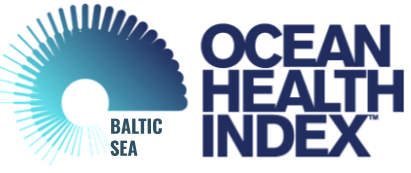

---
output:
  html_document:
    fig_width: 1
    toc: true
    toc_float: true
---

<style>
  .col2 {
    columns: 2 200px;
    -webkit-columns: 2 200px; /* chrome, safari */
    -moz-columns: 2 200px;   /* firefox */
  }
</style>

<!-- <br> --
<!-- <div class="page-lead" style="background-image:url(images/matt-hardy-6ArTTluciuA-unsplash-cropped2.png)"> -->
<!-- <div class="page-lead" style="background-image:url(images/nathan-dumlao-0tykfPL2U7w-unsplash.jpg)"> -->
<div class="page-lead" style="background-image:url(images/banner-image.jpg)">
<div class="wrap page-lead-content">
<br><br><br>
<h3 style="background-color: #0d4353d4;color: #f3ffe1;line-height:60px;font-size: 220%;">  AN OCEAN HEALTH INDEX FOR THE BALTIC SEA </h3>
</div>
</div>

---

<h4 style="font-weight:bold"> Ocean Health Index </h4>

The Ocean Health Index (OHI) measures and tracks the benefits and services that the ocean provides for people now and into the future. Determining ocean health requires an approach that integrates social, economic, and environmental information.

The OHI does this by measuring progress towards widely held goals that represent key benefits and services provided by marine ecosystems. By analyzing these goals together we obtain a comprehensive picture of the state of the ecosystem.

The framework facilitates [transparent and repeatable assessments](https://www.nature.com/articles/s41559-017-0160) of ocean health over time, and can be integrated into ongoing policy initiatives to support sustainable ocean management.

---

<h4 style="font-weight:bold">  Quantifying status of the Baltic Sea </h4>

The Baltic Health Index (BHI) is a regional study applying the OHI framework. The aim is to provide an integrative and transparent tool to be used by decision-makers to guide management of the Baltic Sea towards increased sustainability.

In a first iteration, the BHI was adapted from previous OHI assessments [tailoring the OHI framework](https://peerj.com/articles/1503/) to represent the cultural, social, and ecological characteristics and priorities of Baltic using the best available information and knowledge.

A second iteraction will further develop models specific to the Baltic Sea, and implement more automized routines for data collection and  processing. See project GitHub repositories [bhi-prep](https://github.com/OHI-Baltic/bhi-prep) and [bhi](https://github.com/OHI-Baltic/bhi) for code and documents detailing data collection, exploration and synthesis.

<br> 


<h3 style="font-size:150%;background-color:#b4cace;color:#0a1821;line-height:50px">
ASSESSMENT REGIONS 
</h3>

Regions are the fundamental spatial units of analysis for the Ocean Health Index. Scores are calculated for each region individually and then combined (with an offshore area-weighted average) to produce scores for the entire Baltic Sea.  **There are 42 BHI regions in the Baltic Sea,** created by intersecting exclusive economnic zones (EEZs) with the Baltic Sea subbasins.

```{r setup, echo = F, warning = FALSE, message = F}
source("_site.R")
## read spatial
geojson <- file.path("regions_gcs_simple2x.geojson")
rgns <- geojsonio::geojson_read(geojson, what = "sp")
if("rgn_nam" %in% names(rgns@data) & !"rgn_name" %in% names(rgns@data)){
  rgns@data = rgns@data %>% mutate(rgn_name = rgn_nam)
}
```

---

```{r, out.width = '100%'}
## create and render leaflet map
leaflet::leaflet(data = rgns) %>%
  addProviderTiles(providers$CartoDB.Positron) %>%
  setView(18, 60, zoom = 5) %>%
  addPolygons(
    layerId = ~rgn_id,
    stroke = TRUE, opacity = 0.5, weight = 2, fillOpacity = 0.5, smoothFactor = 0.5,
    color = ~colorNumeric("#6fa0b4", rgns$rgn_id)(rgn_id)) %>%
  addPolygons(
    layerId = ~rgn_id,
    popup = paste("<h5><strong>", "Region:", "</strong>",
                  rgns@data$rgn_nam,"</h5>",
                  "<h5><strong>", "Region BHI ID:", "</strong>", rgns@data$rgn_id, "</h5>"),
    fillOpacity = 0,
    stroke = FALSE
  ) %>% 
  htmlwidgets::onRender("
  function(el, t) {
    var defaultStyle = {
      // stroke, ie polygon border
        opacity:     0.5,
        weight:      2,
      // fill, ie polygon interior
        fillOpacity: 0.5,
    };
    var highlightStyle = {
      // stroke, ie polygon border
        opacity:     0.9,
        weight:      6,
      // fill, ie polygon interior
        fillOpacity: 0.9,
    };
    var myMap = this;
    var layers = myMap._layers;
    for(var i in layers) {
      var layer = layers[i];
      if(layer.label) {
        layer.on('mouseover',
          function(e) {
            this.setStyle(highlightStyle);
            // this.bringToFront();
        });
        layer.on('mouseout',
          function(e) {
            this.setStyle(defaultStyle);
            // this.bringToBack();
        });
      }
    }
  }")
```

<br>

<h3 style="font-size:150%;background-color:#b4cace;color:#0a1821;line-height:50px">
WHO ARE WE?
</h3>
<br>


<div style="width: 74%;">
<p>
<h4 style="font-weight: 500; display: inline;"> Lead Scientist: </h4> 
<h4 style="font-weight: 300; display: inline;"> Thorsten Blenckner </h4>
<br>
[Thorsten Blenckner](https://www.stockholmresilience.org/contact-us/staff/2008-06-16-blenckner.html), quantitative marine ecologist with interests in ecosystem-based management and modeling pressures (e.g. overfishing, salinity, climate, alien species) which trigger regime shifts of the Baltic Sea ecosystem, has led the BHI project since its beginning in 2014.

thorsten.blenckner@su.se
</p>
</div>
<div style="clear:both;"></div>

---


<div style="width: 74%;">
<p>
<h4 style="font-weight: 500; display: inline;"> Data Analyst: </h4> 
<h4 style="font-weight: 300; display: inline;"> Ellie Campbell </h4>
<br>
[Ellie Campbell](https://www.stockholmresilience.org/contact-us/staff/2019-09-03-campbell.html) joined the team in January 2019 to begin work on the second BHI assessment. As a data analyst she helps tailor the Ocean Health Index (OHI) framework to the Baltic Sea, manage datasets behind the models, and support investigation of patterns or interactions.

eleanore.campbell@su.se
</p>
</div>
<div style="clear:both;"></div>

---


<div style="width: 74%;">
<p>
<h4 style="font-weight: 500; display: inline;"> Project Manager: </h4> 
<h4 style="font-weight: 300; display: inline;"> Andrea De Cervo </h4>
<br>
Andrea De Cervo joined the team for second BHI assessment.... As project manager she....

andrea.decervo@su.se
</p>
</div>
<div style="clear:both;"></div>

---


<div style="width: 74%;">
<p>
<h4 style="font-weight: 500; display: inline;"> Marine Food Webs/Dynamics Scientist: </h4> 

<h4 style="font-weight: 300; display: inline;"> Susa Niiranen </h4>
<br>
[Susa Niiranen](https://www.stockholmresilience.org/contact-us/staff/2010-02-02-niiranen.html) contributes expertise in multiple interacting drivers, marine modeling and cross-scale dynamics to the BHI project.

susa.niiranen@su.se
</p>
</div>
<div style="clear:both;"></div>

---

<h3 style="font-size:150%;background-color:#b4cace;color:#0a1821;line-height:50px">
ABOUT THE PROJECT
</h3>

<br>


The Baltic Health Index is a project jointly led by [Stockholm Resilience Centre (SRC)](https://www.stockholmresilience.org/), at Stockholm University, Sweden together with the [Ocean Health Index team](http://ohi-science.org/about/). The first phase has been funded by the Johansson Family foundation and the Baltic Ecosystem Adaptive Management, [BEAM](https://www.su.se/ostersjocentrum/english/beam), a five-year research programme (2010-2014). The second phase, started Jan 2019, is funded by the Johansson Family foundation. 

This trans-disciplinary project is led by [Thorsten Blenckner](https://www.stockholmresilience.org/contact-us/staff/2008-06-16-blenckner.html) at SRC and involves many international researchers from around the Baltic Sea and management organisations.

The Baltic Health Index formally started in 2015 and preliminary scores were completed in 2017. Members of the team conducting the first assessment additionally included Jennifer Griffiths, Ning Jiang, Julie Lowndes, Melanie Frazer, Cornelia Ludwig.  Currently, the third assesssment is conducted by Eleanore Campbell, Andrea De Cervo, Susa Niiranen and Thorsten Blenckner.

<br>

---
<div class="wrap page-lead-content">


</div>
<!--  -->
<!--  -->

