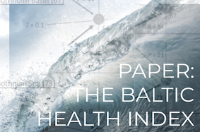
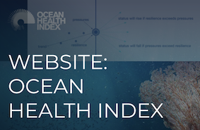
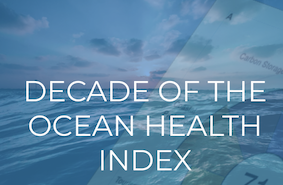
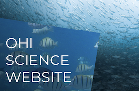
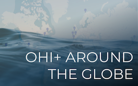

---
output:
  html_document:
    fig_width: 1
    toc: false
    css: css/extra.css
---

<!-- <video autoplay muted loop id="myVideo"> -->
<!-- <source src="images/waves-ruvim-miksanskiy-pexels.mp4" type="video/mp4"> -->
<!-- </video> -->

<!-- <video autoplay muted loop id="myVideo"> -->
<!-- <source src="images/cliffs-rodnae-pexels.mp4" type="video/mp4"> -->
<!-- </video> -->

<video autoplay muted loop id="myVideo">
<source src="images/sea-ad-urpina-pexels.mp4" type="video/mp4">
</video>

<h3 class="header">  
Additional Resources
</h3>

MORE ABOUT THE BALTIC HEALTH INDEX

 

MORE ABOUT THE OHI FRAMEWORK

 

MORE ABOUT REGIONAL ASSESSMENTS

 

<!-- Calculating the Baltic Health Index -->
<!-- <h3 style="background-color:#09232fd1;color:#f3ffe1;line-height:40px;font-size:180%;padding-left:10px;"> -->
<!-- Baltic Health Index Calculations -->
<!-- </h3> -->

<!--  -->

<h4><a href="https://doi.org/10.1002/pan3.10178">The Baltic Health Index (BHI): Assessing the social–ecological status of the Baltic Sea, Blenckner et al.</a></h4>

<!--  -->

<h4><a href="https://github.com/OHI-Science/bhi">Baltic Health Index Score Calculations Repository </a></h4>

<!--  -->

<h4><a href="https://github.com/OHI-Science/bhi-prep">Baltic Health Index Data Preparation Code Repository </a></h4>

<!-- About the Ocean Health Index -->
<!-- <h3 style="background-color:#09232fd1;color:#f3ffe1;line-height:40px;font-size:180%;padding-left:10px;"> -->
<!-- About the Ocean Health Index Framework -->
<!-- </h3> -->

<!--  -->

<h4><a href="http://www.oceanhealthindex.org/">Ocean Health Index Website </a></h4>

<!--  -->

<h4><a href="https://www.cell.com/one-earth/fulltext/S2590-3322(19)30270-2">NCEAS director Ben Halpern reflects on a Decade of the Ocean Health Index </a></h4>

<!--  -->

<h4><a href="https://ohi-science.org/">The Ocean Health Index, Science Website </a></h4>

<!-- OHI Other Regional Assessents -->
<!-- <h3 style="background-color:#09232fd1;color:#f3ffe1;line-height:40px;font-size:180%;padding-left:10px;"> -->
<!-- About the Ocean Health Index Framework -->
<!-- </h3> -->

<!--  -->

<h4><a href="https://ohi-science.org/projects/ohi-assessments/">OHI Regional Assessments, Around the Globe </a></h4>

<!--  -->

<h4><a href="https://www.ohi.sustainable-seas.org/">An Ocean Health Index+ for South West England </a></h4>

<!--  -->

<h4><a href="https://ohi-northeast.shinyapps.io/ne-dashboard/">Shiny Dashboard for the OHI Northeast, USA </a></h4>

 

