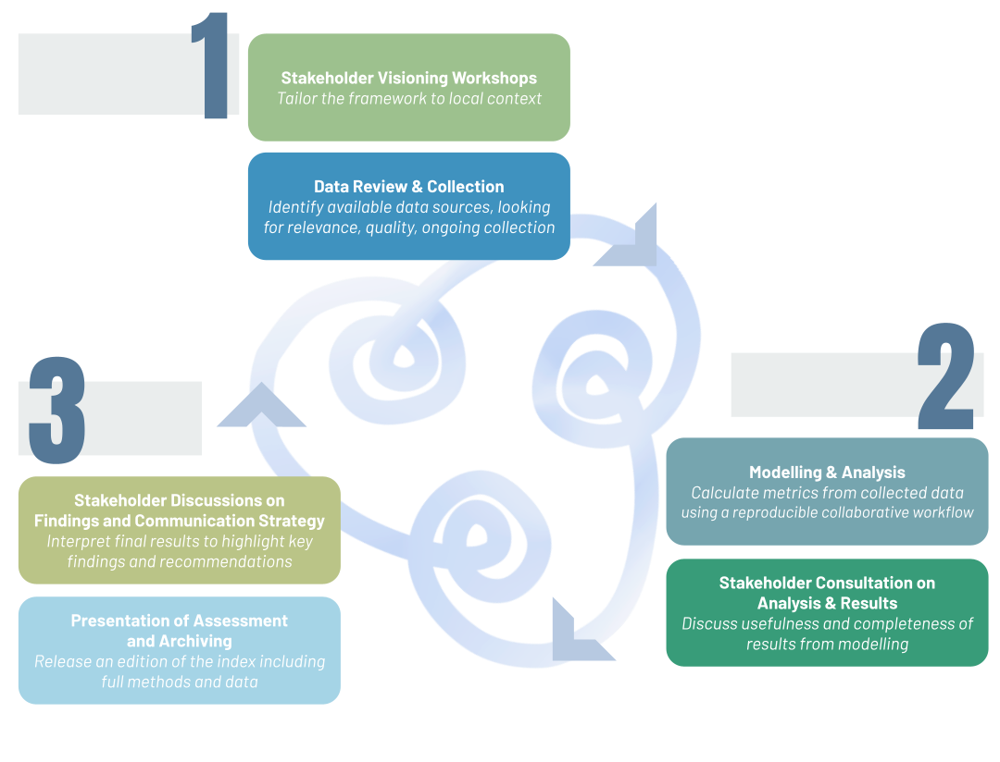

---
output:
  html_document:
    fig_width: 1
    toc: false
    css: css/extra.css
---

<!-- <video autoplay muted loop id="myVideo"> -->
<!-- <source src="images/waves-ruvim-miksanskiy-pexels.mp4" type="video/mp4"> -->
<!-- </video> -->

<!-- <video autoplay muted loop id="myVideo"> -->
<!-- <source src="images/cliffs-rodnae-pexels.mp4" type="video/mp4"> -->
<!-- </video> -->

<video autoplay muted loop id="myVideo">
<source src="images/sea-ad-urpina-pexels.mp4" type="video/mp4">
</video>

<h3 class="header">  
Assessment Process
</h3>

 
Much of the value of the BHI is in the process, which is collaborative, transparent, and iterative. 
 
 
Before beginning: 1) read about the OHI framework to confirm it is the right tool and learn from other earlier assessments, 2) build a team of stakeholders and analysts who will co-create the assessment, and 3) identify the specific needs and spatial area of interest.
 
 
Once the assessment begins, there are three phases: data exploration, modelling, and communication of results. Each involves a dynamic exchange between stakeholders and analysts as the team balances comprehensiveness and feasibility. This exchange is an opportunity identify critical knowledge/data gaps or other limitations. 
 
 
For more details refer to the <a href="http://ohi-science.org/onboarding/" style="color:#126994">OHI onboarding</a> manual by the OHI team.

