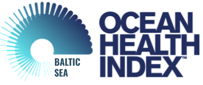

---
output:
  html_document:
    fig_width: 1
    toc: false
    css: css/extra.css
---

<h4 style="font-weight: 500; display: inline;"> Baltic Health Index 2.0: </h4> 
 
 
Results released with [Paper](https://doi.org/10.1002/pan3.10178) published in British Ecological Society journal _People and Nature_. Includes data from years 2009-2019 to assess the condition of the Sea in 2019.

<h4 style="font-weight: 500; display: inline;"> Baltic Health Index 2.1: </h4> 
 
 
An intermediate update, with goals updated including: Fisheries, Natural Products, Artisanal Fishing Opportunity, Economies, and Clean water subgoals (Eutrophication, Contaminants, Trash). Includes data from years 2010-2020 to assess the condition of the Sea in 2020.

 

