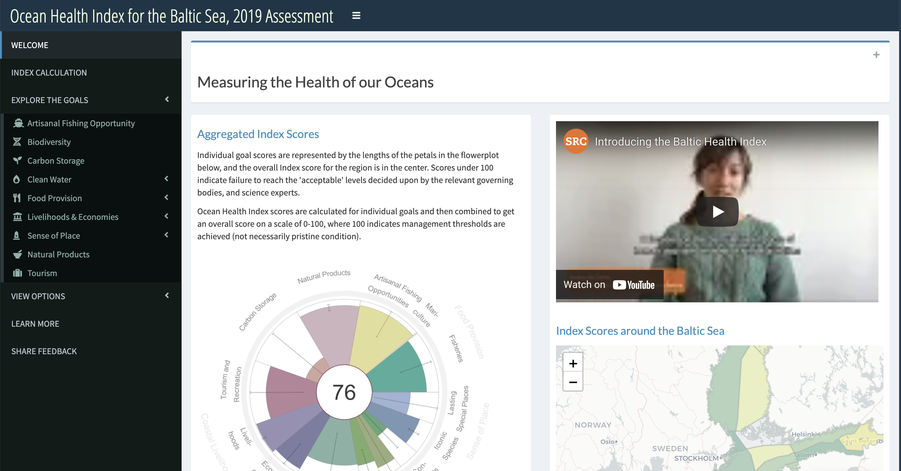
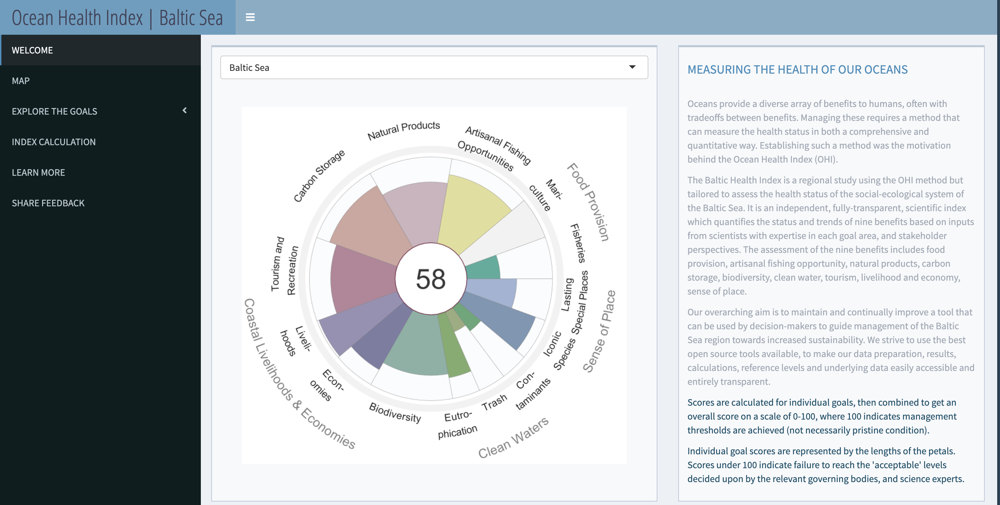

---
output:
  html_document:
    fig_width: 1
    toc: false
    css: css/extra.css
---

<video autoplay muted loop id="myVideo">
<source src="images/waves-ruvim-miksanskiy-pexels.mp4" type="video/mp4">
</video>

<!-- <video autoplay muted loop id="myVideo"> -->
<!-- <source src="images/cliffs-rodnae-pexels.mp4" type="video/mp4"> -->
<!-- </video> -->

<!-- <video autoplay muted loop id="myVideo"> -->
<!-- <source src="images/sea-ad-urpina-pexels.mp4" type="video/mp4"> -->
<!-- </video> -->

<h3 style="background-color:#09232fd1;color:#f3ffe1;line-height:60px;font-size:220%;padding-left:10px;">
Versions of the Index
</h3>

The Baltic Health Index (BHI) is a measure of overall progress towards regional sustainability of coastal and marine systems. This website provides access to references, underlying data, and associated results and maps for the pilot study from 2019, and 2020 intermediate update of the Index. The dashboards and linked documents made available here provide in-depth details on the analytical framework, quantitative methodology, and data sources that underlie each version. Note that because of data and methodological improvements to subsequent versions of the Index, scores from different assessment versions cannot be combined and utilized in time-series analysis.

 

<h4 style="font-weight: 500; display: inline;"> Baltic Health Index 2.0: </h4> 
 
 
Results released with [Paper](https://doi.org/10.1002/pan3.10178) published in British Ecological Society journal _People and Nature_. Includes data from years 2009-2019 to assess the condition of the Sea in 2019.

<h4 style="font-weight: 500; display: inline;"> Baltic Health Index 2.1: </h4> 
 
 
An intermediate update, with goals updated including: Fisheries, Natural Products, Artisanal Fishing Opportunity, Economies, and Clean water subgoals (Eutrophication, Contaminants, Trash). Includes data from years 2010-2020 to assess the condition of the Sea in 2020.

