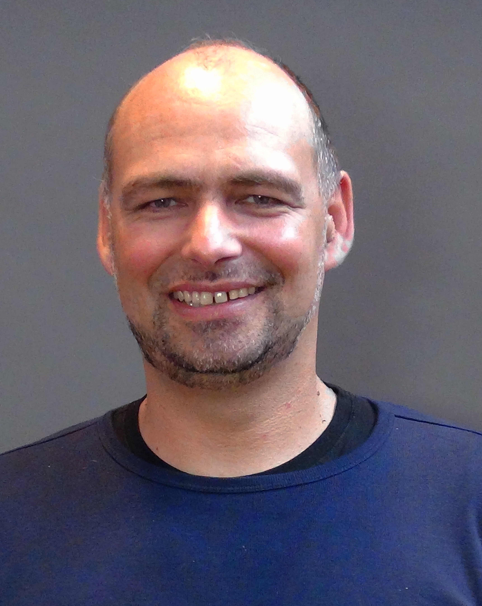
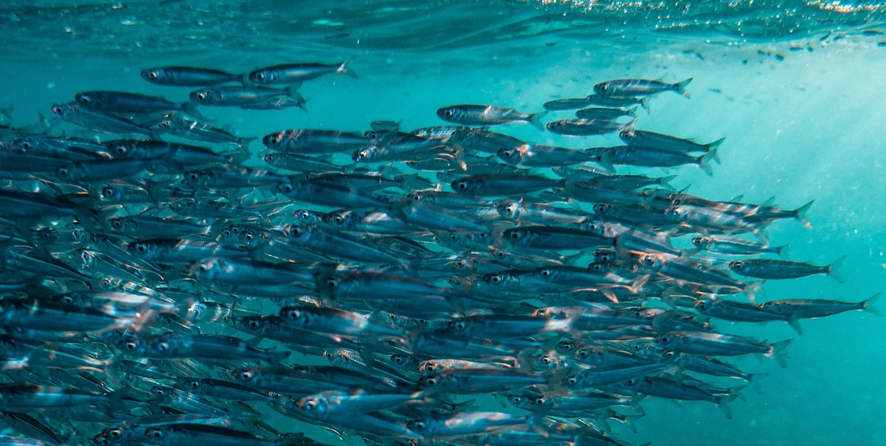
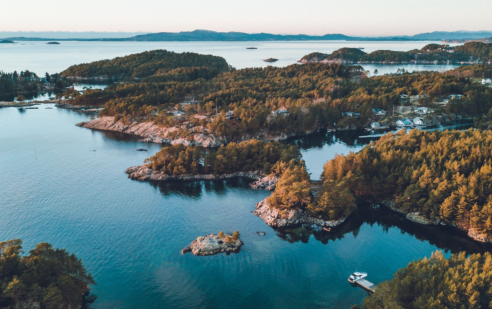
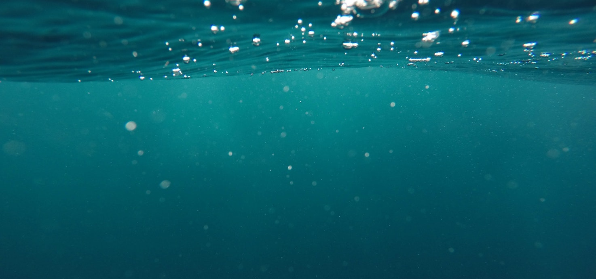
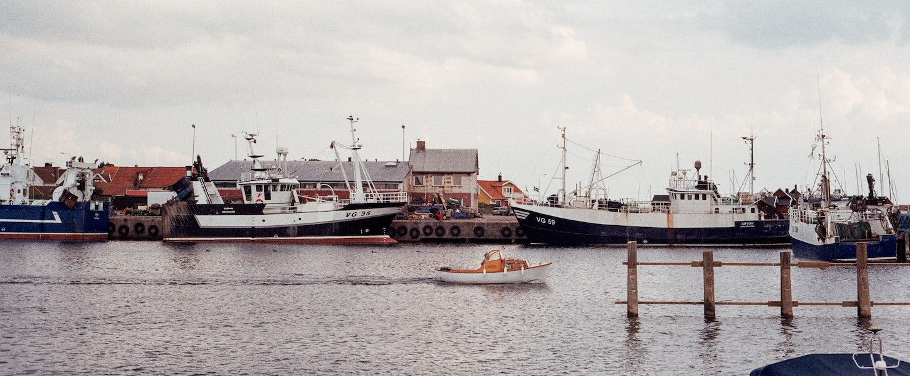

---
output:
  html_document:
    fig_width: 1
    toc: false
    css: css/extra.css
---

<!-- <video autoplay muted loop id="myVideo"> -->
<!-- <source src="images/waves-ruvim-miksanskiy-pexels.mp4" type="video/mp4"> -->
<!-- </video> -->

<!-- <video autoplay muted loop id="myVideo"> -->
<!-- <source src="images/cliffs-rodnae-pexels.mp4" type="video/mp4"> -->
<!-- </video> -->

<video autoplay muted loop id="myVideo">
<source src="images/sea-ad-urpina-pexels.mp4" type="video/mp4">
</video>

<!-- About the project -->
<h3 class="header">  
About the Project
</h3>

 

The Baltic Health Index is a project jointly led by [Stockholm Resilience Centre (SRC)](https://www.stockholmresilience.org/), at Stockholm University, Sweden together with the [Ocean Health Index team](http://ohi-science.org/about/). The first phase has been funded by the Johansson Family foundation and the Baltic Ecosystem Adaptive Management, [BEAM](https://www.su.se/ostersjocentrum/english/beam), a five-year research programme (2010-2014). The second phase, started Jan 2019, is funded by the Johansson Family foundation. 

This trans-disciplinary project is led by [Thorsten Blenckner](https://www.stockholmresilience.org/contact-us/staff/2008-06-16-blenckner.html) at SRC and involves many international researchers from around the Baltic Sea and management organisations.

The Baltic Health Index formally started in 2015 and preliminary scores were completed in 2017. Members of the team conducting the first assessment additionally included Jennifer Griffiths, Ning Jiang, Julie Lowndes, Melanie Frazer, Cornelia Ludwig.  Currently, the third assesssment is conducted by Eleanore Campbell, Andrea De Cervo, Susa Niiranen and Thorsten Blenckner.

The project would not have been possible without our funders and the generosity and expertise of our 'goalkeeers' (see below).

  

<!-- BHI Team -->

<h3 class="header">  
The Core BHI Team
</h3>

<!-- row with multiple bios -->

<!-- Thorsten bio -->

<h4 style="font-weight: 500; display: inline;"> Lead Scientist: </h4> 
<h4 style="font-weight: 300; display: inline;"> Thorsten Blenckner </h4>
 
[Thorsten Blenckner](https://www.stockholmresilience.org/contact-us/staff/2008-06-16-blenckner.html), quantitative marine ecologist with interests in ecosystem-based management and modeling pressures (e.g. overfishing, salinity, climate, alien species) which trigger regime shifts of the Baltic Sea ecosystem, has led the BHI project since its beginning in 2014.

thorsten.blenckner@su.se

<!-- Ellie bio -->

<h4 style="font-weight: 500; display: inline;"> Data Analyst: </h4> 
<h4 style="font-weight: 300; display: inline;"> Eleanore Campbell </h4>
 
[Eleanore Campbell](https://www.stockholmresilience.org/contact-us/staff/2019-09-03-campbell.html) joined the team in 2019. As a data analyst she helps tailor the Ocean Health Index (OHI) framework to the Baltic Sea, manage data sets behind the models, and support investigation of patterns or interactions.

eleanore.campbell@su.se

<!-- end row with multiple bios -->

<!-- row with multiple bios -->

<!-- Andrea bio -->

<h4 style="font-weight: 500; display: inline;"> Project Manager: </h4> 
<h4 style="font-weight: 300; display: inline;"> Andrea De Cervo </h4>
 
Andrea De Cervo joined the team for the second BHI assessment. As project manager she helps coordinate the project, collect and analyze updated data and improve methods of assessing Baltic sea health together with experts around the Baltic.

andrea.decervo@su.se

<!-- Susa bio -->

<h4 style="font-weight: 500; display: inline;"> Marine Food Webs/Dynamics Scientist: </h4> 

<h4 style="font-weight: 300; display: inline;"> Susa Niiranen </h4>
 
[Susa Niiranen](https://www.stockholmresilience.org/contact-us/staff/2010-02-02-niiranen.html) contributes expertise in multiple interacting drivers, marine modeling and cross-scale dynamics to the BHI project.

susa.niiranen@su.se

<!-- end row with multiple bios -->

<!-- Goalkeepers-->
<h3 class="header">  
Science Experts
</h3>

<!-- row with multiple bios -->

<h4 style="font-weight: 300; display: inline;"> Andrea Belgrano </h4>
 
[Andrea Belgrano](https://www.slu.se/en/ew-cv/andrea-belgrano/) advices on the Biodiversity goal.

andrea.belgrano@slu.se

<h4 style="font-weight: 300; display: inline;"> Henn Ojaveer </h4>
 
[Henn Ojaveer](https://www.etis.ee/CV/Henn_Ojaveer/eng) advices on the Biodiversity goal.

henn.ojaveer@ut.ee

<!-- end row with multiple bios -->

<!-- row with multiple bios -->

<h4 style="font-weight: 300; display: inline;"> Jens Olson </h4>
 
[Jens Olson](https://www.slu.se/cv/jens-olsson/) advices on the Artisanal Fishing Opportunity goal.

jens.olsson@slu.se

<h4 style="font-weight: 300; display: inline;"> Sofia Wikström </h4>
 
[Sofia Wikström](https://www.su.se/english/profiles/swiks-1.196117) advices on the Lasting Special Places subgoal.

sofia.wikstrom@su.se

<!-- end row with multiple bios -->

<!-- row with multiple bios -->

<h4 style="font-weight: 300; display: inline;"> Anna Sobek </h4>
 
[Anna Sobek](https://www.aces.su.se/staff/anna-sobek/) advices on the Contaminants subgoal.

Anna.Sobek@aces.su.se

<h4 style="font-weight: 300; display: inline;"> Vivi Fleming </h4>
 
[Vivi Fleming](https://wwwp.ymparisto.fi/scripts/hapa/h.asp?Method=PERSONFORM&txtuserid=10758&txthaku=&txtlang=EN&txtselsuborgid=3022&txtofficeid=&txtorgid=10) advices on the Eutrophication subgoal.

Vivi.Fleming@syke.fi 

<!-- end row with multiple bios -->

<!-- row with multiple bios -->

<h4 style="font-weight: 300; display: inline;"> Christian Möllmann </h4>
 
[Christian Möllmann](https://www.biologie.uni-hamburg.de/forschung/oekologie-biologische-ressourcen/maroeksysdyn/mitarbeiter/moellmann.html) advices on the Fisheries goal.

christian.moellmann@uni-hamburg.de

<h4 style="font-weight: 300; display: inline;"> Stefan Neuenfeldt </h4>
 
[Stefan Neuenfeldt](https://orbit.dtu.dk/en/persons/stefan-neuenfeldt) advices on the Fisheries goal.

stn@aqua.dtu.dk

<!-- end row with multiple bios -->

<!-- row with multiple bios -->

<h4 style="font-weight: 300; display: inline;"> Viitasalo Markku </h4>
 
[Viitasalo Markku](https://www.syke.fi/en-US/Experts/Markku_Viitasalo(44270)) advices on the Carbon Storage goal.

viitasalo.markku@ymparisto.fi

<h4 style="font-weight: 300; display: inline;"> Christoffer Boström </h4>
 
[Christoffer Boström](https://www.abo.fi/en/contact/christoffer-bostrom/) advices on the Carbon Storage goal.

christoffer.bostrom@abo.fi

<!-- end row with multiple bios -->

<!-- row with multiple bios -->

<h4 style="font-weight: 300; display: inline;"> Annika Nilsson </h4>
 
[Annika Nilsson](https://katalog.uu.se/empinfo/?id=N2-1011) advices on the social resilience dimensions of the Index.

annika.nilsson@jur.uu.se

<h4 style="font-weight: 300; display: inline;"> Wilfried Rickels </h4>
 
[Wilfried Rickels](https://www.ifw-kiel.de/experts/ifw/wilfried-rickels/) advices on the Livelihood and Economies goal.

wilfried.rickels@ifw-kiel.de

<!-- end row with multiple bios -->

<!-- row with multiple bios -->

<h4 style="font-weight: 300; display: inline;"> Gerald Schernewski </h4>
 
[Gerald Schernewski](https://katalog.uu.se/empinfo/?id=N2-1011) advices on the Trash subgoal.

gerald.schernewski@io-warnemuende.de

<!-- end row with multiple bios -->

<!-- Additional partners -->

<!-- <h3 class="header">   -->
<!-- Partner organizations -->
<!-- </h3> -->

<!--   -->

<h3 class="header">  
Funding
</h3>

 

The Baltic Health Index project was supported by the BEAM programme, which was funded 2010–2014 by special Swedish government grants, and kindly continuously supported by the Johansson Family Foundation. Thorsten Blenckner was funded by BEAM, the Johansson Family Foundation and by FORMAS (‘When the sum is unknown - a concrete approach to disentangle multiple driver impacts on the Baltic Sea ecosystem’ project). 

 

